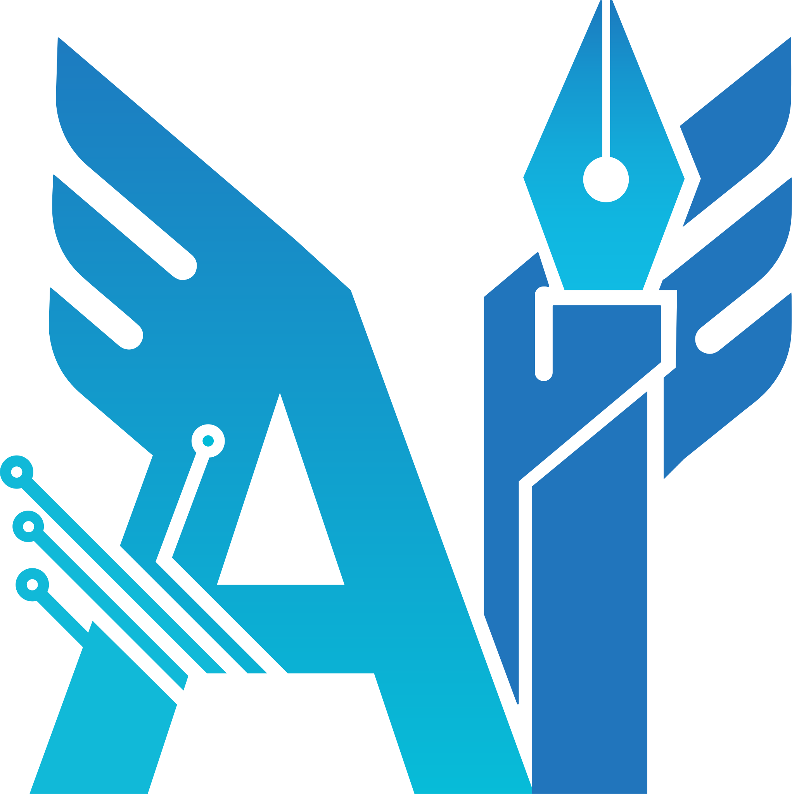

<picture>
  <source srcset="assets/IOT-LOGO-Blue.svg" type="image/svg+xml" width="200" alt="logo main"> 
 <!-- اصلی -->

<!-- فال‌بک -->
</picture>

<!--  -->

  <b>🌐 Language:</b> 
  English | <a href="README_FA.md">فارسی</a>

<h1 style="color:#003366; font-family:Calibri;">
AI & IoT Student Scientific Association  
of Yadegar-e-Imam University
</h1>

Welcome to the official GitHub page of the 
<b>Artificial Intelligence & Internet of Things Student Scientific Association</b>  
at <b>Yadegar-e-Imam University, Tehran</b>. 
We are a student-driven academic community dedicated to fostering innovation, research,  
and technological advancement in both <b>AI</b> and <b>IoT</b>.

---

<h2 style="color:#003366; font-family:Calibri;">🎓 About Us</h2>

The <b>AI & IoT Student Scientific Association</b> operates under the Faculty of Computer Engineering.  
Our mission is to bridge <b>theoretical knowledge</b> with <b>hands-on engineering practice</b>—training students in the  
rapidly evolving domains of Artificial Intelligence and the Internet of Things.

<ul style="color:white; font-family:Cambria;">
<li>Scientific research, experimentation, and innovation</li>
<li>Hands-on development of IoT and smart systems</li>
<li>Knowledge-sharing and open collaboration</li>
<li>Real-world application of intelligent and connected technologies</li>
</ul>

---

<h2 style="color:#003366; font-family:Calibri;">🔬 Core Activities</h2>

<ul style="color:white; font-family:Cambria;">
<li><b>Specialized Courses & Training:</b> Machine learning, deep learning, embedded systems, microcontrollers, and IoT platforms.</li>
<li><b>Technical Workshops:</b> Practical training in AI model development, sensor integration, communication protocols, and system deployment.</li>
<li><b>Seminars & Webinars:</b> Talks and discussions with academics, engineers, and industry professionals.</li>
<li><b>Research Collaborations:</b> Student-led projects in AI, IoT, robotics, smart automation, and data-driven technologies.</li>
</ul>

---

<h2 style="color:#003366; font-family:Calibri;">📚 Research & Educational Projects</h2>

Our repositories host open-access resources, educational material, and research projects in:

<ul style="color:white; font-family:Cambria;">
<li>Machine Learning & Deep Learning</li>
<li>Computer Vision & Natural Language Processing</li>
<li>IoT Systems and Sensor Networks</li>
<li>Embedded Systems & Microcontroller Programming</li>
<li>Robotics, Smart Automation, and Predictive Analytics</li>
</ul>

<blockquote style="color:#cccccc; font-family:Cambria;">
All content is open-access to promote transparency, learning, and collaborative innovation.
</blockquote>

---

<h2 style="color:#003366; font-family:Calibri;">📅 Academic Engagement</h2>

<ul style="color:white; font-family:Cambria;">
<li>Academic seminars, competitions, and student conferences</li>
<li>Joint research with university labs and departments</li>
<li>AI & IoT workshops and hands-on training programs</li>
<li>Mentoring and support for student engineering projects</li>
</ul>

---

<h2 style="color:#003366; font-family:Calibri;">📫 Contact & Collaboration</h2>

📧 <b>Email:</b> <a href="mailto:yadegar.ai.ssa@gmail.com" style="color:#4da6ff;">yadegar.ai.ssa@gmail.com</a> 
📢 <b>Telegram Channel:</b> <a href="https://t.me/yadegar_aiot" style="color:#4da6ff;">@yadegar_aiot</a> 
🏢 <b>Linkedin:</b> <a href="https://www.linkedin.com/company/yadegar-aiot/" style="color:#4da6ff;">@yadegar-aiot</a> 
🧩 <b>Secretary:</b> Roshanak Aboudi — <a href="https://github.com/Roshanak-Aboudi" style="color:#4da6ff;">@Roshanak-Aboudi</a> 
👤 <b>Public Relations:</b> Mohammadreza Ahmadi (mohyahy) — <a href="https://t.me/AI_ssa_yi_iau" style="color:#4da6ff;">@AI_ssa_yi_iau</a> 
🌐 <b>University Website:</b> <a href="https://yi.iau.ir/en" style="color:#4da6ff;">Yadegar-e-Imam University</a>

---

  <h3 style="color:#003366; font-family:Calibri; display: flex; align-items: center; justify-content: center; gap: 10px;">
    
    “Empowering innovation through intelligence, connectivity, and academic collaboration.”
    
  </h3>

  

    <i>AI & IoT Student Scientific Association — Yadegar-e-Imam University, Tehran, Iran</i>
  

---

<h2 style="color:#003366; font-family:Calibri;">🤝 Affiliated & Supporting Bodies</h2>

This student scientific association operates under and in collaboration with the following organizations:

  

  

